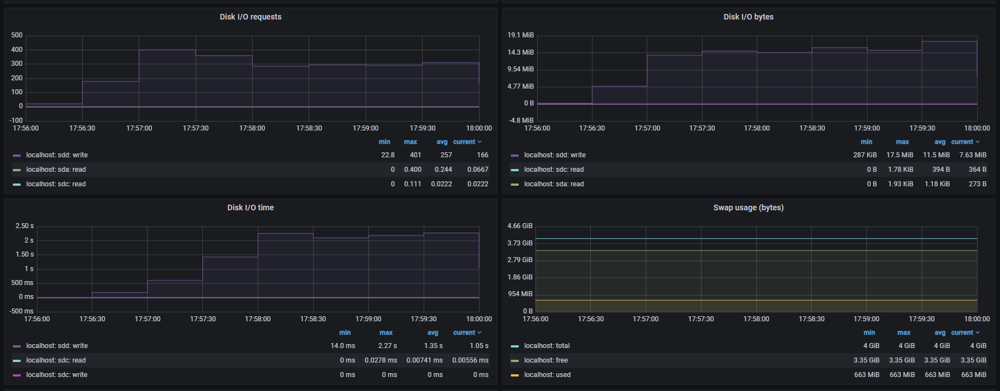

### Configure graylog

1. Go to http://localhost:9000/system/inputs
2. Select Beats input
3. Click Launch new input
4. Enter a title. Leave all other fields with default values.
5. Click Launch input
6. Restart docker compose.

### Generate logs
dotnet run --project .\MySqlTest.DataGenerator\MySqlTest.DataGenerator.csproj

## Results

### ELK stack

### Graylog stack

### Conclusion

ELK and Graylog use similar amount of resources. Elastic Search consumes slightly more CPU than Open Search, and Graylog consumes slightly more CPU than Logstash. Also, Open Search consumes slightly more memory than Elastic Search, but that's compensated by Kibana in ELK stack which also takes some memory. 
